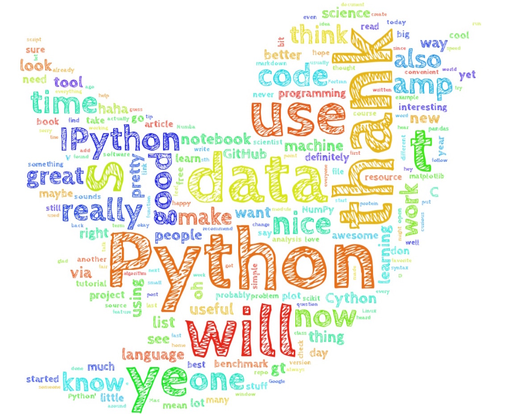
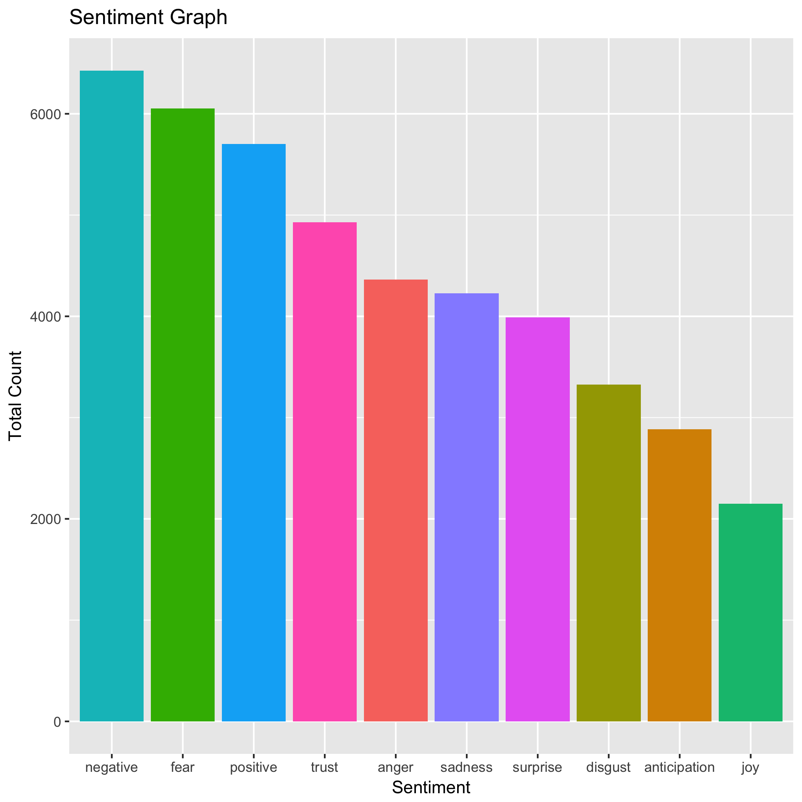
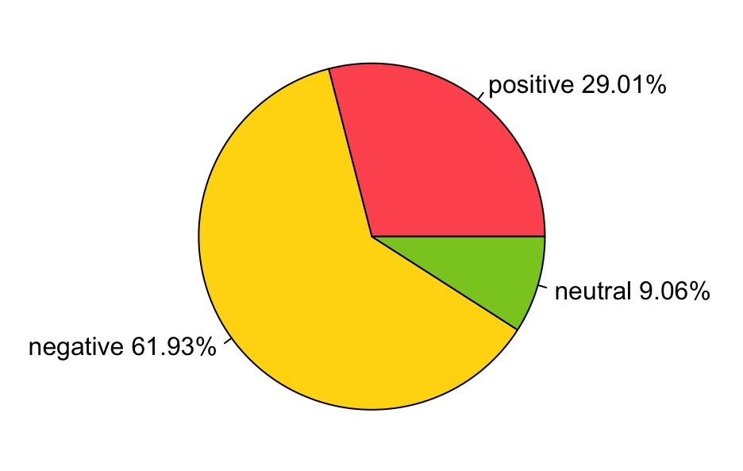
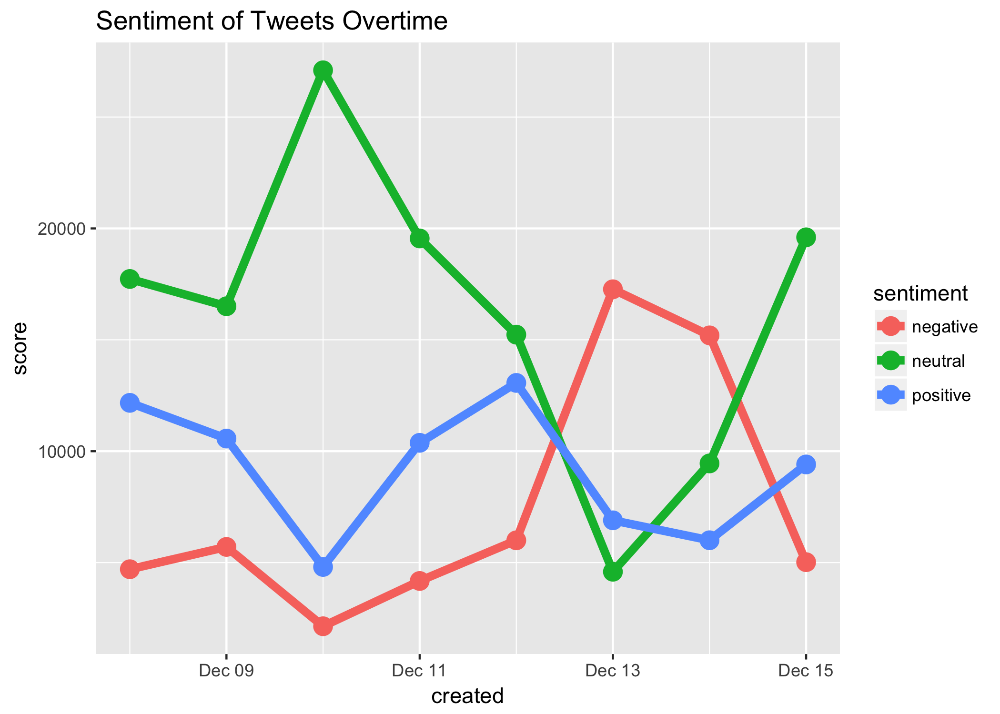
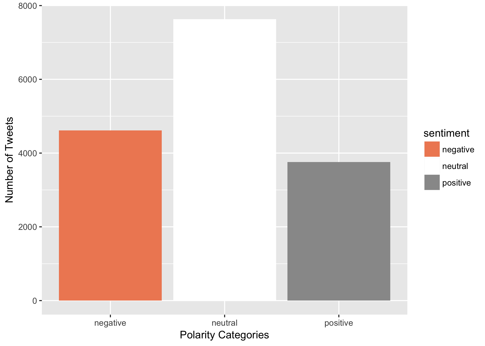
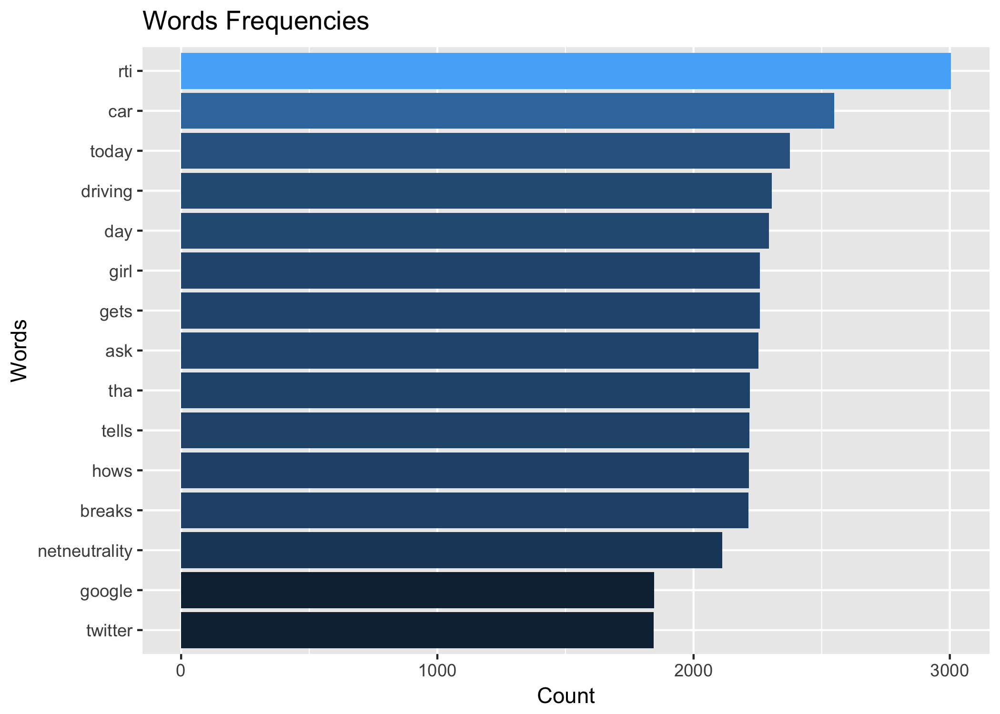
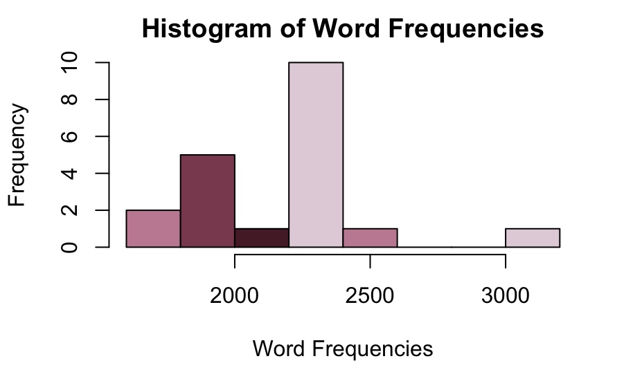

## Introduction
```{r, echo=FALSE, out.width = "100px", fig.align="center"}
knitr::include_graphics("./assets/uber.jpg")
```
    Uber has dominated the private transportation business in the past 8 years. What began in 2008 as a luxury car service in San Francisco, CA is now valued at $70 billion and operates in more than 300 cities worldwide. To passengers, it's a convenient, affordable service. 
  However, recently Uber rides fares have increased very quickly in the past year. In addition, they have implmented new algorithms for finding fastest routes and optimizing the pick up and drop off schedule of shared rides, and such new features had positive and negative impact on the quality of service.
  Therefore, for this analysis, I was curious about what the tweets on Uber say, how frequent they are, and from where are they being tweeted! I will use Twitter's API to obtain tweets on Uber and analyze them in R.

## Dataset
```{r, echo=FALSE, out.width = "300px", fig.align="center"}

```

  I used Twitter's API to collect tweets on different days. I collected 2000 english tweets on days between Dec 9-15, so a total of 16000 tweets. Cleaning of tweets included removing: numbers, punctuations, urls, special charachters, brand name, and common english words such as pronouns and propositions.

## Sentimenal Analysis of Text
Using get_nrc_sentiment() from the `syuzhet` package to analyze the snetiments in the tweets collected, we notice that most tweets had a negative sentiments comapred to positive ones. Categories "negative" and "fear" are the most frequent among the tweets. 

```{r, echo=FALSE, out.width = "450px", fig.align="center"}

```

## Polarity of Sentiment
I used the sentimental analysis above and combined the positive feelings (joy, trust, positive, anticipation) count, and the negative (anger, disgust, fear, sadness, negative) feelings count, and calculated the precentages of each.

```{r, echo=FALSE, out.width = "200px", results='asis'}
df <- read.csv(file="./data/polarity.csv", header=TRUE)
knitr::kable(df, caption = "Polarity Table")
```

## Visualizing Sentiment Polarity
I used a pie chart to visualize the table in the previous slide. Again, here were see the overall breakdown of polarity of sentiment. Negative sentiment dominates the tweets overall.
  
```{r, echo=FALSE, out.width = "500px", fig.align="center"}

```

## Sentiment Polarity Variation Overtime
I was also curious about the sentiment change over time. Overall, the tweets are mostly nuetral between Dec 9-11. However, we notice a peak in the negative sentiment on Dec 13th, and in fact, that aligns with news released on the 13th on ["Uber Under Criminal Investigation, Justice Dept. Confirms in Letter to Court"](https://www.nytimes.com/2017/12/13/technology/uber-waymo-driverless-cars.html)

```{r, echo=FALSE, out.width = "400px", fig.align="center"}

```

## Sentiment Polarity and # of Retweets
Finally I wanted to see if there is a correlation betwee the number of retweets of a tweet and it's sentiment. Most retweeted tweets have neutral sentiment. We notice, however, that negative tweets are retweeted more than positive tweets.

```{r, echo=FALSE, out.width = "500px", fig.align="center"}

```

## Statistical Analysis
The mean of word frequencies is 27, median is 4, and a standard deviation of 156.
The min and max are 2 and 3005 respectively, which means that the mean is skewed to the left because most words have a frequency of 4. 
Finally the qualtiles. 95% of the words have frquencies less than 64, and 50% of the words have frequencies less than or equal to 4.

## Words Frequency
```{r, echo=FALSE, out.width = "600px", fig.align="center"}

```

## Histogram of Words Frequencies
```{r, echo=FALSE, out.width = "600px", fig.align="center"}

```
